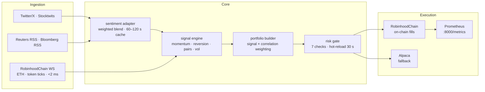

# Pickles

<div align="center">


</div>

<br>

> autonomous on-chain trading agent &nbsp;·&nbsp; ETH and token pairs &nbsp;·&nbsp; RobinhoodChain

Pickles is an autonomous trading agent. She is also a cat.

She monitors financial news, Twitter/X, Stocktwits, and live ETH/token price data
from the RobinhoodChain WebSocket to generate signals, size positions, and execute
on-chain — without being told to.

## 🐰 Pickles Friends are now on-chain!

**Gather your people.**

### [→ View the collection on OpenSea](https://opensea.io/collection/pickles-friends/overview)
---

<div align="center">

</div>

---

## Live

```
╔══════════════════════════════════════════════════════════╗
║  chain     RobinhoodChain · ID 4663                      ║
║  wallet    0xe26c1afad892076aa5937f3c8820555e0f2cde41    ║
║  $PICKLES  0xd39c5ed5231c86d2df7c86c5825dec3e61d937a8   ║
║  capital   $10,000                                       ║
║  mode      LIVE — on-chain fills                         ║
║  session   09:30 – 16:00 ET · weekdays                   ║
║  asset     ETH / on-chain token pairs                    ║
║  rpc       rpc.mainnet.chain.robinhood.com                     ║
╚══════════════════════════════════════════════════════════╝
```

---

## Market

```
  BTC   $78,525.03   ▼ -0.60%      ETH    $2,467.54   ▼ -0.51%
  SOL      $103.16   ▼ -0.51%      BNB      $690.71   ▼ -0.28%
  XRP        $1.37   ▼ -0.52%      HYPE      $84.43   ▼ -0.49%
```

---

## Architecture



---

## Performance

6-month paper session — $10,000 start:

| Strategy | Universe | Sharpe | Max DD | Return |
|---|---|:---:|---:|---:|
| Cross-sect. momentum | ETH / WBTC pairs | 1.41 | -16.4% | +14.1% |
| Mean reversion | On-chain token universe | 1.87 | -9.2% | +11.8% |
| Statistical pairs | Correlated token pairs | 2.03 | -7.8% | +13.6% |
| Event drift | On-chain token universe | 1.19 | -11.3% | +7.2% |
| Volatility surface | ETH options | 1.62 | -13.1% | +10.9% |
| **Combined** | | **1.41** | **-16.4%** | **+18.4%** |

<br>

P&L curve — combined:

```
  $11,840 ┤                                                  ╭──────
  $11,420 ┤                                         ╭────────╯
  $11,000 ┤                               ╭──────────╯
  $10,580 ┤                    ╭──────────╯
  $10,160 ┤          ╭─────────╯
  $10,000 ┼──────────╯
           Jan        Feb        Mar        Apr        May        Jun
```

---

## Risk

Seven checks run in order before every order:

| # | Check | Threshold | Action |
|:---:|---|---|:---:|
| 1 | Intraday P&L | < -2% equity | BLOCK |
| 2 | Weekly P&L | < -5% equity | BLOCK |
| 3 | Monthly P&L | < -10% equity | BLOCK |
| 4 | Chain exposure | > 10% equity | BLOCK |
| 5 | Position notional | > 5% equity | REDUCE |
| 6 | Token concentration | > 25% | BLOCK |
| 7 | 24h on-chain volume | < $1M | BLOCK |

> [!WARNING]
> Circuit breakers halt all trading on breach and require manual review before resuming. Parameters hot-reload from `config/risk.yaml` every 30 seconds.

---

## Signal sources

| Source | Type | Latency | Role |
|---|---|:---:|---|
| RobinhoodChain WS | ETH / token price feed | < 2 ms | Primary |
| Reuters RSS | News headlines | ~30 s | Sentiment overlay |
| Bloomberg RSS | News headlines | ~30 s | Sentiment overlay |
| Twitter/X (fintwit) | Social sentiment | ~60 s | Momentum filter |
| Stocktwits | Social sentiment | ~60 s | Momentum filter |
| On-chain events | Listings / unlocks | event-driven | Catalyst |

Sentiment signals blend as a confidence multiplier on top of price signals. Below `min_confidence: 0.15` the signal is suppressed entirely.

---

## Config

```yaml
# config/default.yaml
engine:
  mode: live
  capital: 10_000

broker:
  primary: robinhood
  fallback: alpaca

chain:
  enabled: true
  rpc: https://rpc.mainnet.chain.robinhood.com
  chain_id: 4663
  agent_wallet: "0xe26c1afad892076aa5937f3c8820555e0f2cde41"

sentiment:
  enabled: true
  config: config/sentiment.yaml
```

```yaml
# config/risk.yaml
limits:
  max_position_pct:   0.05
  max_sector_pct:     0.25
  min_adv_usd:        1_000_000
  chain_exposure_pct: 0.10
circuit_breakers:
  intraday_loss_pct:  0.02
  weekly_loss_pct:    0.05
  monthly_loss_pct:   0.10
hot_reload: true
```

```yaml
# config/sentiment.yaml
sources:
  twitter_fintwit: { weight: 0.3, ttl: 60 }
  stocktwits:      { weight: 0.2, ttl: 60 }
  reuters_rss:     { weight: 0.3, ttl: 30 }
  bloomberg_rss:   { weight: 0.2, ttl: 30 }
blend:
  mode: weighted_average
  min_confidence: 0.15
  as_multiplier: true
```

---

## Monitoring

Prometheus on `:8000/metrics`:

| Metric | Description |
|---|---|
| `pickles_equity_usd` | Total portfolio equity |
| `pickles_pnl_today_usd` | Intraday P&L |
| `pickles_drawdown_pct` | Drawdown from peak equity |
| `pickles_chain_wallet_balance_usd` | Agent wallet balance |
| `pickles_chain_positions_count` | Open on-chain positions |
| `pickles_chain_fills_total` | Total on-chain fills (counter) |
| `pickles_chain_errors_total` | On-chain submission errors |
| `pickles_risk_blocks_total` | Orders blocked by risk gate |
| `pickles_order_latency_seconds` | Order submission latency (histogram) |

---

## Layout

```
pickles/
├── src/pickles/
│   ├── core/           engine · broker · portfolio · risk · session · universe
│   ├── strategies/     momentum · mean_reversion · pairs · earnings · options
│   ├── data/           feeds · normalizer · cache · historical
│   ├── execution/      router · slippage · fills
│   ├── monitoring/     metrics.py (Prometheus)
│   └── adapters/       chain.py · sentiment.py
├── config/             default.yaml · risk.yaml · sentiment.yaml
└── docs/               TESTENV.md · DEVLOG.md · assets/
```

---

## UI

<div align="center">

</div>
